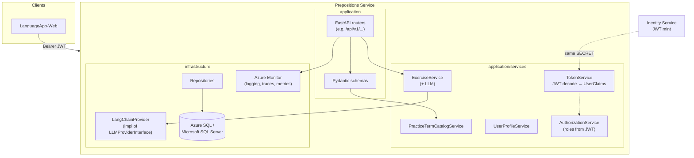

# LanguageApp Prepositions Service

Backend API for **preposition / function-word practice** (**catalog of practice terms**), **user learning profiles**, **languages**, and **generated writing exercises**. Generation and grading use an **LLM** behind a **provider abstraction** (**LangChain** `init_chat_model`).

It is a consumer of the **Identity Service**: callers send **JWT access tokens** issued there. The **`service_name`** in settings must align with **`roles`** claim keys produced by Identity so **RBAC** works (e.g. **`prepositions-service`** with roles like **`prepositions-user`**).

---

## Architecture

Layers mirror the Identity service (**routers → schemas → services → repositories**) with extras for **JWT claim parsing** (no duplicate user DB) and **LLM prompts**.



**JWT flow**

1. **`TokenService`** decodes Bearer tokens (**`secret_token_key`** and **`auth_algorithm`** must match Identity).
2. **`UserClaims`** holds **`roles`**: **`{ "<service-name>": ["role1", ...] }`** (for this API, typically **`prepositions-service`**).
3. **`AuthorizationService`** reads **`service_name`** from settings and validates required roles (`check_role`, etc.).

**Exercise generation**

Prompts live in **`infrastructure/llm/prompts.py`**. **`LangChainProvider`** uses **`structured_output`** to force JSON-aligned results for **`ExercisePrompt`** / **`ExerciseEvaluation`**.

---

## Patterns in this codebase

| Area | Pattern |
| --- | --- |
| **Routing** | `APIRouter` modules under **`application/routers/`** (**`dependency_utils.py`** — shared `Depends()` for **`TokenService`**, **`AuthorizationService`**, DB session, repos). |
| **Validation** | Pydantic v2 models under **`application/schemas/`** (e.g. **`ExerciseRequest`**, **`ExercisePromptResponse`**). |
| **Domain** | Entities and repository **interfaces** under **`domain/`**; infrastructure implements those interfaces (`exercise_repository`, etc.). |
| **JWT** | **Decode-only** — no user table sync; aligns with **`domain/entities/token_claims.UserClaims`**. |
| **LLM** | **`LLMProviderInterface`** (**`domain/interfaces/llm_provider.py`**) implemented by **`infrastructure.llm.langchain_provider.LangChainProvider`**. Extend by installing **`langchain-<provider>`** and setting **`LLM_*`** env vars (see **`.env_template`**). |
| **Persistence** | Async SQLAlchemy + **Azure SQL/SQL Server** via **`create_async_engine`** (**`ENGLISH_DATABASE_URL`**). **`LongAsMax=Yes`** is appended automatically for ODBC compatibility. |
| **Observability** | **`azure-monitor-opentelemetry`**, custom Azure handlers/metrics decorators under **`infrastructure/observability/`**. |

---

## Prerequisites

- **Python** 3.11+.
- **Azure SQL / SQL Server** with ODBC (**Driver 18**).
- **`LLM_API_KEY`** and network access for the chosen **`LLM_PROVIDER`** (OpenAI, Anthropic, etc., per **`requirements.txt`**).
- Matching **JWT signing** configuration as **Identity**: **`SECRET_TOKEN_KEY`**, **`AUTH_ALGORITHM`**.
- **`SERVICE_ID`** and **`SERVICE_NAME`** registered consistently in Identity (service catalog / RBAC), e.g. **`prepositions-service`**.

---

## Configuration

Copy **`.env_template`** to **`.env`**. **`load_dotenv()`** runs before **`core.settings`** in **`main.py`**.

Critical keys are documented inline in **`core/settings.py`**. Highlights:

| Variable | Purpose |
| --- | --- |
| **`ENGLISH_DATABASE_URL`** | Async **`mssql+aioodbc://...`** for the app |
| **`ENGLISH_DATABASE_MIGRATION_URL`** | Sync **`mssql+pyodbc://...`** for Alembic |
| **`SECRET_TOKEN_KEY`**, **`AUTH_ALGORITHM`** | Must match Identity for JWT verification |
| **`SERVICE_ID`**, **`SERVICE_NAME`** | Must match Identity’s service registry and JWT role keys |
| **`LLM_*`** | Provider, API key, model, temperature |

For Azure-hosted apps, **`SQLCONNSTR_*`**-style overrides are supported (**`model_validator`** in **`settings.py`**) akin to Identity.

---

## Database setup and migrations

1. Create the target database on SQL Server/Azure SQL (e.g. **`PrepositionsDB`**).

2. Point **`ENGLISH_DATABASE_MIGRATION_URL`** (Alembic) and **`ENGLISH_DATABASE_URL`** (runtime) per **`.env_template`**.

3. From repo root:

   ```bash
   alembic upgrade head
   ```

Alembic uses **`ENGLISH_DATABASE_MIGRATION_URL`** through **`alembic/env.py`**, models under **`infrastructure/databases/models.py`**, and **`Base.metadata`** for autogenerate.

---

## Run the HTTP API locally

```bash
python -m venv .venv
.venv\Scripts\activate
python -m pip install -r requirements.txt
uvicorn main:app --reload --host 127.0.0.1 --port 8002
```

Use **`--port`** that matches your **`LanguageApp-Web`** **`VITE_API_PREPOSITIONS_URL`**.

Swagger: **`http://127.0.0.1:8002/docs`** (adjust host/port if you changed them).

---

## Automated tests

**PyTest** — **`pytest.ini`**, **`tests/`**, **`requirements.txt`** (`pytest`, `pytest-asyncio`).

```bash
python -m pip install -r requirements.txt
python -m pytest tests -v
```

**`tests/conftest.py`** sets minimal environment defaults before **`settings`** imports for modules that validate at import time.

---

## Related repositories

| Project | Relationship |
| --- | --- |
| **`LanguageApp-IdentitySvc`** | Issues JWTs consumed here; **`SERVICE_NAME`** must match JWT `roles` keys |
| **`LanguageApp-Web`** | SPA with **Prepositions** practice UX (`VITE_API_PREPOSITIONS_URL`) |
